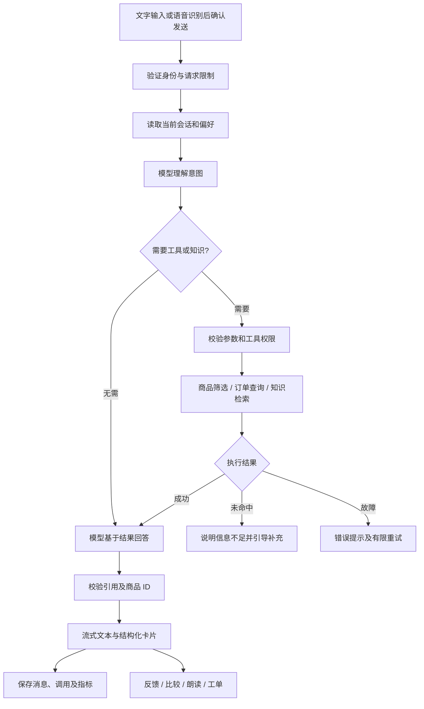
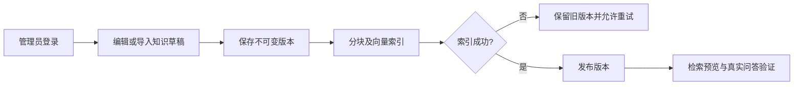
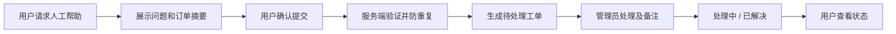

# ShopAgent 核心流程

日期：2026-11-17。此文档为拟定流程。

## 对话与工具调用

```mermaid
flowchart TD
    A[文字输入或语音识别后确认发送] --> B[验证身份与请求限制]
    B --> C[读取当前会话和偏好]
    C --> D[模型理解意图]
    D --> E{需要工具或知识?}
    E -->|需要| F[校验参数和工具权限]
    F --> G[商品筛选 / 订单查询 / 知识检索]
    G --> H{执行结果}
    H -->|成功| I[模型基于结果回答]
    H -->|未命中| J[说明信息不足并引导补充]
    H -->|故障| K[错误提示及有限重试]
    E -->|无需| I
    I --> L[校验引用及商品 ID]
    L --> M[流式文本与结构化卡片]
    M --> N[保存消息、调用及指标]
    M --> O[反馈 / 比较 / 朗读 / 工单]
```

## 知识发布

```mermaid
flowchart LR
    A[管理员登录] --> B[编辑或导入知识草稿]
    B --> C[保存不可变版本]
    C --> D[分块及向量索引]
    D --> E{索引成功?}
    E -->|否| F[保留旧版本并允许重试]
    E -->|是| G[发布版本]
    G --> H[检索预览与真实问答验证]
```

## 售后工单

```mermaid
flowchart LR
    A[用户请求人工帮助] --> B[展示问题和订单摘要]
    B --> C[用户确认提交]
    C --> D[服务端验证并防重复]
    D --> E[生成待处理工单]
    E --> F[管理员处理及备注]
    F --> G[处理中 / 已解决]
    G --> H[用户查看状态]
```
